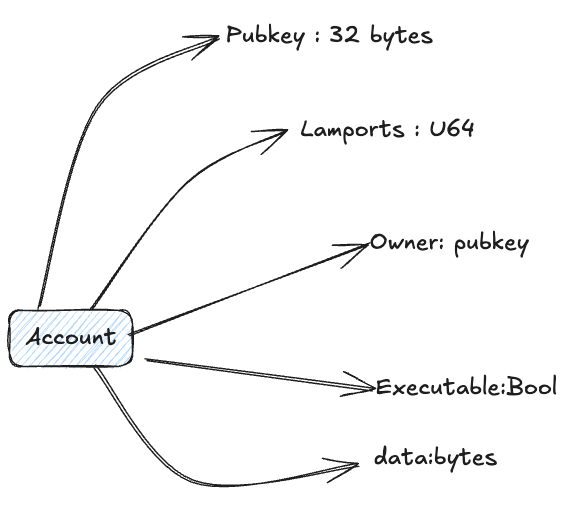
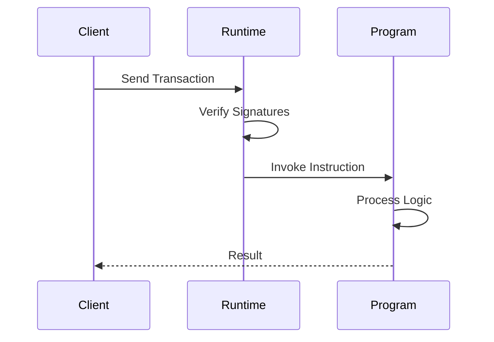
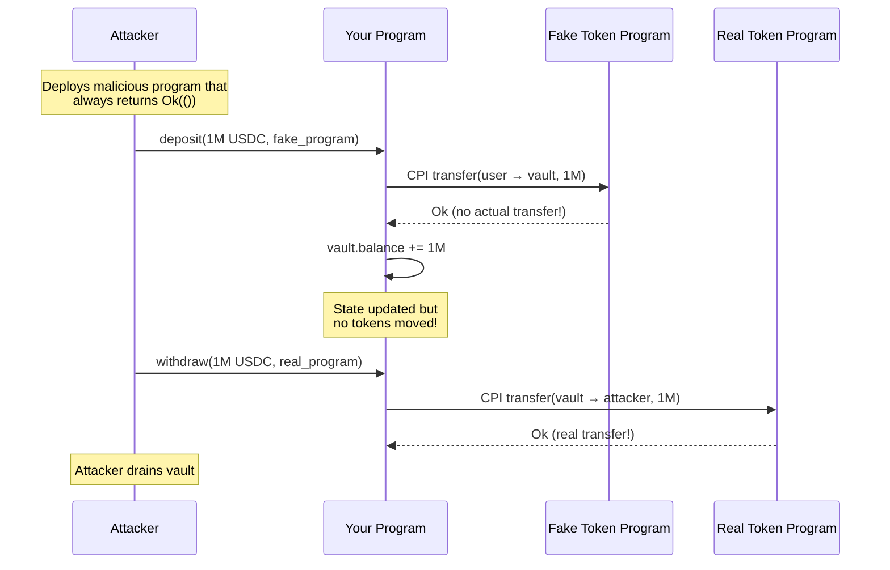
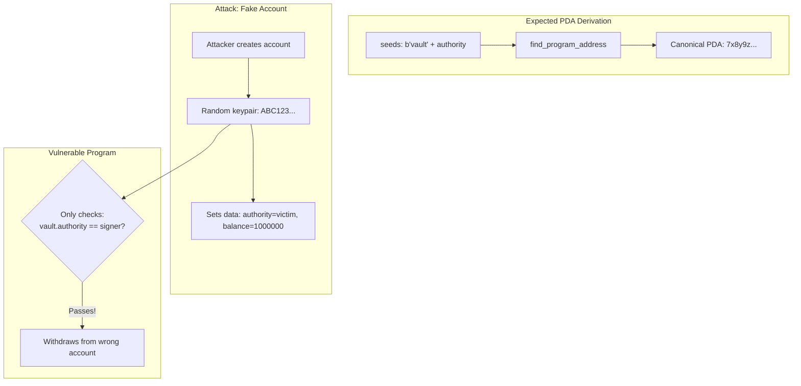
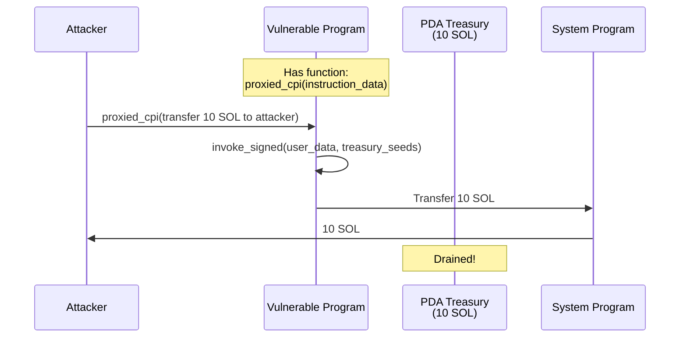

# Anchor & Pinocchio Security

A comprehensive learning resource for Solana program security, comparing **Anchor** (high-level) and **Pinocchio** (low-level) frameworks. This repository contains hands-on examples of common vulnerabilities, showing how each framework handles security differently.

Apart from this general readme, each module has its own interactive file that goes into much more line by line detail about each vulnerability and interactive tests, and real world examples.

---

## Table of Contents

1. [Overview](#overview)
2. [Repository Structure](#repository-structure)
3. [Anchor vs Pinocchio](#anchor-vs-pinocchio)
4. [Prerequisites](#prerequisites)
5. [Getting Started](#getting-started)
6. [Modules](#modules)
   - [01 - Access Control](#01---access-control)
   - [02 - Account Life Cycle](#02---account-life-cycle)
   - [03 - Logic and Arithmetic Bugs](#03---logic-and-arithmetic-bugs)
   - [04 - CPI Bugs](#04---cpi-bugs)
   - [05 - Data Validation](#05---data-validation)
   - [06 - Program Upgrade Bugs](#06---program-upgrade-bugs)
   - [07 - Type Casting and Truncation](#07---type-casting-and-truncation)
   - [08 - Signature Bugs](#08---signature-bugs)
   - [09 - Account Confusion](#09---account-confusion)
7. [Learning Path](#learning-path)
8. [Resources](#resources)

---

## Overview

Solana programs (smart contracts) are susceptible to various security vulnerabilities due to the unique execution model of the Solana Virtual Machine (SVM). Unlike EVM-based chains, Solana separates code from data, uses Program Derived Addresses (PDAs), and relies on Cross-Program Invocation (CPI) for composability. These architectural differences introduce a distinct set of security considerations.

### Solana Account Model

Everything on Solana is an account. Unlike Ethereum where contracts have their own storage, Solana separates **code** (programs) from **data** (accounts). Programs are stateless executables that read and write to accounts passed into them.



| Field | Size | Description | Security Relevance |
|-------|------|-------------|-------------------|
| **pubkey** | 32 bytes | Unique address on the network | Used to identify and reference accounts |
| **lamports** | 8 bytes | Balance in lamports (1 SOL = 10⁹ lamports) | Rent-exempt minimum required; draining = account deletion |
| **owner** | 32 bytes | Program that controls this account | **Only the owner can modify data**; critical for access control |
| **data** | Variable | Arbitrary bytes storing state | Programs serialize/deserialize; discriminators prevent type confusion |
| **executable** | 1 bit | If true, account contains a program | Programs can be invoked; regular accounts cannot |

**Key Security Insights:**

1. **Owner = Authority**: Only the program specified in `owner` can modify the account's `data` and debit `lamports`. This is enforced by the runtime.

2. **Anyone Can Credit**: Any account can receive lamports, but only the owner can debit.

3. **Data is Untrusted**: When your program receives an account, you must verify:
   - The `owner` is who you expect (your program or a known program)
   - The `data` contains valid, expected values
   - The account is a signer if it needs to authorize actions

4. **Rent**: Accounts must maintain a minimum lamport balance (rent-exempt) or they'll be garbage collected.

### Transaction Flow




This CTF provides:

- **Vulnerable Programs**: Intentionally flawed implementations that demonstrate each vulnerability class
- **Fixed Programs**: Secure implementations showing the correct patterns to mitigate each vulnerability
- **Test Suites**: TypeScript tests that demonstrate how to exploit the vulnerable programs and verify the fixes work correctly
- **Documentation**: Detailed explanations of each vulnerability, its impact, and remediation strategies

---

## Repository Structure

```
anchor-pinocchio-security/
│
├── README.md
├── 01-access-control/                  # Module 01: Access Control
│   ├── README.md
│   ├── anchor/programs/
│   │   ├── 01-missing-signer-vulnerable/
│   │   ├── 01-missing-signer-fixed/
│   │   ├── 02-missing-owner-vulnerable/
│   │   ├── 02-missing-owner-fixed/
│   │   ├── 03-pda-substitution-vulnerable/
│   │   └── 03-pda-substitution-fixed/
│   └── pinocchio/programs/
│       ├── missing-signer-vulnerable/
│       └── missing-signer-fixed/
│
├── 02-account-life-cycle/              # Module 02: Account Lifecycle
│   ├── README.md
│   ├── anchor/programs/
│   │   ├── 01-reinitialization-vulnerable/
│   │   ├── 01-reinitialization-fixed/
│   │   ├── 02-account-resurrection-vulnerable/
│   │   └── 02-account-resurrection-fixed/
│   └── pinocchio/programs/
│       ├── reinitialization-vulnerable/
│       └── reinitialization-fixed/
│
├── 03-logic-and-arithmetic-bugs/       # Module 03: Arithmetic Bugs
│   ├── README.md
│   ├── anchor/programs/
│   │   ├── 01-integer-overflow-vulnerable/
│   │   ├── 01-integer-overflow-fixed/
│   │   ├── 02-precision-loss-vulnerable/
│   │   └── 02-precision-loss-fixed/
│   └── pinocchio/programs/
│       ├── integer-overflow-vulnerable/
│       └── integer-overflow-fixed/
│
├── 04-cpi-bugs/                        # Module 04: CPI Bugs
│   ├── README.md
│   ├── anchor/programs/
│   │   ├── 01-unchecked-program-id-vulnerable/
│   │   ├── 01-unchecked-program-id-fixed/
│   │   ├── 02-unchecked-pda-vulnerable/
│   │   ├── 02-unchecked-pda-fixed/
│   │   ├── 03-arbitrary-cpi-vulnerable/
│   │   └── 03-arbitrary-cpi-fixed/
│   └── pinocchio/programs/
│       ├── unchecked-program-id-vulnerable/
│       └── unchecked-program-id-fixed/
│
├── 05-data-validation/                 # Module 05: Data Validation
│   ├── README.md
│   ├── anchor/programs/
│   │   ├── 01-type-confusion-vulnerable/
│   │   ├── 01-type-confusion-fixed/
│   │   ├── 02-range-check-vulnerable/
│   │   ├── 02-range-check-fixed/
│   │   ├── 03-duplicate-account-vulnerable/
│   │   └── 03-duplicate-account-fixed/
│   └── pinocchio/programs/
│       ├── range-check-vulnerable/
│       └── range-check-fixed/
│
├── 06-program-upgrade-bugs/            # Module 06: Program Upgrade
│   ├── README.md
│   ├── anchor/programs/
│   │   ├── 01-storage-collision-v1/
│   │   ├── 01-storage-collision-v2/
│   │   └── 01-storage-collision-fixed/
│   └── pinocchio/programs/
│       ├── upgrade-authority-vulnerable/
│       └── upgrade-authority-fixed/
│
├── 07-type-casting-truncation/         # Module 07: Type Casting
│   ├── README.md
│   ├── anchor/programs/
│   │   ├── truncation-vulnerable/
│   │   └── truncation-fixed/
│   └── pinocchio/programs/
│       ├── truncation-vulnerable/
│       └── truncation-fixed/
│
├── 08-signature-bugs/                  # Module 08: Signature Bugs
│   ├── README.md
│   ├── anchor/programs/
│   │   ├── 01-signature-vulnerable/
│   │   ├── 01-signature-fixed/
│   │   ├── 02-introspection-vulnerable/
│   │   └── 02-introspection-fixed/
│   └── pinocchio/programs/
│       ├── signature-verification-vulnerable/
│       └── signature-verification-fixed/
│
├── 09-account-confusion/               # Module 09: Account Confusion
│   ├── README.md
│   ├── anchor/programs/
│   │   ├── pool-vulnerable/
│   │   └── pool-fixed/
│   └── pinocchio/programs/
│       ├── type-confusion-vulnerable/
│       └── type-confusion-fixed/
│
└── tests/                              # Shared test utilities
```

---

## Anchor vs Pinocchio

This CTF includes implementations in both **Anchor** and **Pinocchio** frameworks to demonstrate how security patterns differ between high-level and low-level approaches.

### What is Anchor?

Anchor is the most popular Solana development framework. It provides:
- Declarative account validation via Rust macros
- Automatic serialization/deserialization with Borsh
- Type-safe account handling
- Built-in security checks through type constraints

### What is Pinocchio?

Pinocchio is a zero-copy, lightweight framework for maximum performance:
- Direct memory access without copying
- Minimal runtime overhead
- Explicit control flow with no hidden magic
- Smaller binary sizes and lower compute costs

### Framework Comparison

| Aspect | Anchor | Pinocchio |
|--------|--------|-----------|
| **Abstraction Level** | High-level, declarative | Low-level, explicit |
| **Signer Check** | Implicit via `Signer<'info>` | Explicit `is_signer()` call |
| **Owner Check** | Implicit via `Account<'info, T>` | Explicit `owner()` comparison |
| **Data Access** | Type-safe: `account.field` | Raw bytes: `data[offset..offset+size]` |
| **Serialization** | Automatic Borsh | Manual byte manipulation |
| **Binary Size** | Larger (~100KB+) | Smaller (~10KB) |
| **Compute Usage** | Higher (deserialization) | Lower (zero-copy) |
| **Learning Curve** | Easier for beginners | Requires Solana expertise |

### Security Comparison

**Anchor - Implicit Security**

```rust
#[derive(Accounts)]
pub struct Withdraw<'info> {
    #[account(mut, has_one = authority)]
    pub vault: Account<'info, Vault>,  // Owner + type checked automatically
    pub authority: Signer<'info>,       // Signature checked automatically
}
```

Anchor generates these checks behind the scenes:
- `vault.owner == program_id`
- `vault.authority == authority.key()`
- `authority.is_signer == true`

**Pinocchio - Explicit Security**

```rust
fn withdraw(program_id: &Pubkey, accounts: &[AccountInfo]) -> ProgramResult {
    let [vault, authority] = accounts else { return Err(...) };

    // Must check is_signer manually
    if !authority.is_signer() {
        return Err(ProgramError::MissingRequiredSignature);
    }

    // Must check owner manually
    if vault.owner() != program_id {
        return Err(ProgramError::IncorrectProgramId);
    }

    // Must verify stored authority manually
    let vault_data = unsafe { vault.borrow_data_unchecked() };
    if &vault_data[0..32] != authority.key().as_ref() {
        return Err(ProgramError::InvalidAccountData);
    }

    // All checks passed
}
```

### Security Trade-offs

| Framework | Advantages | Disadvantages |
|-----------|------------|---------------|
| **Anchor** | Type system catches bugs at compile time; Hard to forget checks; Clear, readable code | Abstractions hide actual checks; Larger attack surface; Performance overhead |
| **Pinocchio** | Full visibility into all checks; Maximum performance; Minimal dependencies | Must remember every check manually; Easy to forget a critical check; Harder to audit |

### When to Use Each

**Use Anchor when:**
- Building your first Solana program
- Developer velocity is more important than micro-optimizations
- Working with a team that needs readable, maintainable code
- Your program is complex with many account types

**Use Pinocchio when:**
- Maximum performance is critical (high-frequency trading, etc.)
- Binary size matters (on-chain storage costs)
- You need fine-grained control over memory
- Your program is simple with few accounts

## Prerequisites

Before running the modules, ensure you have the following installed:

### Rust

Install Rust using rustup:

```bash
curl --proto '=https' --tlsv1.2 -sSf https://sh.rustup.rs | sh
rustup default stable
rustup update
```

### Solana CLI

Install the Solana CLI tools (version 1.18 or higher):

```bash
sh -c "$(curl -sSfL https://release.anza.xyz/stable/install)"
```

Verify installation:

```bash
solana --version
```

### Anchor Framework

Install Anchor CLI (version 0.32 or higher):

```bash
cargo install --git https://github.com/coral-xyz/anchor avm --locked
avm install latest
avm use latest
```

Verify installation:

```bash
anchor --version
```

### Node.js and Yarn

Install Node.js (version 18 or higher) and Yarn:

```bash
# Using nvm (recommended)
nvm install 18
nvm use 18

# Install yarn
npm install -g yarn
```

---

## Getting Started

### 1. Clone the Repository

```bash
git clone https://github.com/superteam/anchor-pinocchio-security.git
cd anchor-pinocchio-security
```

### 2. Install Dependencies

```bash
yarn install
```

### 3. Run a Module

Navigate to any module and run its tests:

```bash
cd 07-type-casting-truncation/anchor
yarn install
anchor test
```

The test output will show both the vulnerability being exploited and the fix being verified.

---

## Modules

### 01 - Access Control

**Location**: `01-access-control/`

Access control vulnerabilities occur when a program fails to properly verify that the caller has permission to perform an action. This is one of the most common and critical vulnerability classes in Solana programs.

**Vulnerabilities Covered**:

- **Missing Signer Check**: The program does not verify that a required account has signed the transaction, allowing anyone to impersonate an authority.

- **Missing Owner Check**: The program does not verify that an account is owned by the expected program, allowing attackers to pass in accounts with manipulated data.

**Vulnerable Pattern**:

```rust
// Missing signer check - anyone can call this
pub fn withdraw(ctx: Context<Withdraw>, amount: u64) -> Result<()> {
    // No verification that authority signed the transaction
    transfer_funds(ctx.accounts.vault, ctx.accounts.recipient, amount)
}
```

**Secure Pattern**:

```rust
// Anchor automatically verifies the signer constraint
#[derive(Accounts)]
pub struct Withdraw<'info> {
    #[account(signer)]
    pub authority: Signer<'info>,  // Must sign the transaction
    // ...
}
```

---

### 02 - Account Life Cycle

**Location**: `02-account-life-cycle/`

Account lifecycle vulnerabilities arise from improper handling of account states during creation, update, and deletion operations.

**Vulnerabilities Covered**:

- **Uninitialized Account Usage**: Using an account before it has been properly initialized, leading to undefined behavior.

- **Reinitialization Attack**: Allowing an already-initialized account to be reinitialized, potentially overwriting critical data.

- **Unsafe Account Closing**: Failing to properly zero out account data when closing, leaving residual data that could be exploited.


**Vulnerable Pattern**:

```rust
// Vulnerable to reinitialization - no check if already initialized
pub fn initialize(ctx: Context<Initialize>, data: u64) -> Result<()> {
    let account = &mut ctx.accounts.data_account;
    account.value = data;  // Can be called multiple times
    Ok(())
}
```

**Secure Pattern**:

```rust
// Anchor's init constraint prevents reinitialization
#[derive(Accounts)]
pub struct Initialize<'info> {
    #[account(
        init,                              // Creates new account
        payer = authority,
        space = 8 + DataAccount::INIT_SPACE
    )]
    pub data_account: Account<'info, DataAccount>,
}
```

---

### 03 - Logic and Arithmetic Bugs

**Location**: `03-logic-and-arithmetic-bugs/`

Arithmetic vulnerabilities occur when mathematical operations produce unexpected results due to overflow, underflow, or precision loss.

**Vulnerabilities Covered**:

- **Integer Overflow**: When a calculation exceeds the maximum value of the integer type, wrapping around to a small value.

- **Integer Underflow**: When a subtraction produces a negative result in an unsigned integer, wrapping around to a large value.

- **Precision Loss**: When division or type conversion loses significant digits, leading to incorrect calculations.

**Vulnerable Pattern**:

```rust
// Vulnerable to overflow - no bounds checking
pub fn deposit(ctx: Context<Deposit>, amount: u64) -> Result<()> {
    let vault = &mut ctx.accounts.vault;
    vault.total = vault.total + amount;  // Could overflow
    Ok(())
}
```

**Secure Pattern**:

```rust
// Use checked arithmetic to prevent overflow
pub fn deposit(ctx: Context<Deposit>, amount: u64) -> Result<()> {
    let vault = &mut ctx.accounts.vault;
    vault.total = vault.total
        .checked_add(amount)
        .ok_or(ErrorCode::Overflow)?;
    Ok(())
}
```

---

### 04 - CPI Bugs

**Location**: `04-cpi-bugs/`

Cross-Program Invocation (CPI) vulnerabilities occur when a program invokes another program without proper validation of the target program or the accounts passed to it.

#### Vulnerability 1: Unchecked Program ID



#### Vulnerability 2: Unchecked PDA



#### Vulnerability 3: PDA Signer Abuse



**Vulnerabilities Covered**:

- **Unchecked Program ID**: Invoking a user-supplied program without verifying it is the expected program, allowing attackers to substitute malicious programs.

- **Unchecked PDA Derivation**: Accepting a Program Derived Address (PDA) without verifying its derivation seeds, allowing attackers to pass fake PDAs.

- **Arbitrary CPI Signer**: Allowing user-controlled data in a CPI call that is signed by the program's PDA, enabling attackers to craft malicious instructions.

**Vulnerable Pattern**:

```rust
// Vulnerable - target_program is not verified
pub fn transfer(ctx: Context<Transfer>) -> Result<()> {
    let cpi_ctx = CpiContext::new(
        ctx.accounts.target_program.to_account_info(),  // Could be malicious
        // ...
    );
    invoke(&cpi_ctx)?;
    Ok(())
}
```

**Secure Pattern**:

```rust
// Fixed - program type is enforced by Anchor
#[derive(Accounts)]
pub struct Transfer<'info> {
    pub target_program: Program<'info, System>,  // Must be System Program
}
```

---

### 05 - Data Validation

**Location**: `05-data-validation/`

Data validation vulnerabilities occur when programs accept user input without proper bounds checking or format validation.

**Vulnerabilities Covered**:

- **Missing Bounds Checks**: Accepting values outside the expected range, leading to unexpected behavior.

- **Missing Constraint Validation**: Failing to verify relationships between accounts or values.

**Vulnerable Pattern**:

```rust
// No validation on user input
pub fn set_fee(ctx: Context<SetFee>, fee_bps: u16) -> Result<()> {
    ctx.accounts.config.fee_bps = fee_bps;  // Could be 10000 (100%)
    Ok(())
}
```

**Secure Pattern**:

```rust
pub fn set_fee(ctx: Context<SetFee>, fee_bps: u16) -> Result<()> {
    require!(fee_bps <= 1000, ErrorCode::FeeTooHigh);  // Max 10%
    ctx.accounts.config.fee_bps = fee_bps;
    Ok(())
}
```

---

### 06 - Program Upgrade Bugs

**Location**: `06-program-upgrade-bugs/`

Program upgrade vulnerabilities relate to the unsafe management of upgradeable programs and their authorities.

**Vulnerabilities Covered**:

- **Unprotected Upgrade Authority**: Failing to secure the upgrade authority, allowing unauthorized program modifications.

- **Migration Vulnerabilities**: Improper handling of state during program upgrades.

---

### 07 - Type Casting and Truncation

**Location**: `07-type-casting-truncation/`

Type casting vulnerabilities occur when converting between integer types using the `as` keyword, which can silently truncate values.

**Vulnerabilities Covered**:

- **Silent Truncation**: Using `as u64` to cast a `u128` discards the high bits without error, leading to massive value loss.

- **Sign Casting**: Casting a negative `i64` to `u64` produces a very large positive number.

**Vulnerable Pattern**:

```rust
// Vulnerable - silent truncation occurs
pub fn calculate(ctx: Context<Calculate>, multiplier: u64) -> Result<()> {
    let result_u128: u128 = (value as u128) * (multiplier as u128);
    let result: u64 = result_u128 as u64;  // High bits silently discarded
    Ok(())
}
```

**Secure Pattern**:

```rust
// Fixed - try_from returns error on overflow
pub fn calculate(ctx: Context<Calculate>, multiplier: u64) -> Result<()> {
    let result_u128: u128 = (value as u128) * (multiplier as u128);
    let result: u64 = u64::try_from(result_u128)
        .map_err(|_| ErrorCode::Overflow)?;
    Ok(())
}
```

---

### 08 - Signature Bugs

**Location**: `08-signature-bugs/`

Signature vulnerabilities occur when programs fail to properly verify cryptographic signatures or signature authorities.

#### Signer vs Signature

A critical distinction on Solana that often causes confusion:

| Concept | Description | When to Use | Check Method |
|---------|-------------|-------------|--------------|
| **Signer** | Account that signed the *transaction* | Authorizing on-chain actions | `Signer<'info>` or `is_signer()` |
| **Signature** | Off-chain signed *message* | Gasless transactions, delegated actions | Ed25519 program verification |

**Signer** - Transaction Authorization:
```rust
// Anchor: Signer type automatically verified by runtime
#[derive(Accounts)]
pub struct Withdraw<'info> {
    pub authority: Signer<'info>,  // Must have signed the transaction
}

// Pinocchio: Manual check required
if !authority.is_signer() {
    return Err(ProgramError::MissingRequiredSignature);
}
```

**Signature** - Off-chain Message Verification:
```rust
// For verifying off-chain signed messages (e.g., gasless meta-transactions)
// The Ed25519 program must verify BEFORE your instruction

// Transaction structure:
// Instruction 0: Ed25519Program::verify(pubkey, message, signature)
// Instruction 1: YourProgram::execute(message, signature)

// In your program, verify Ed25519 instruction was included:
pub fn execute_with_signature(
    ctx: Context<Execute>,
    message: Vec<u8>,
    signature: [u8; 64],
) -> Result<()> {
    // Check instruction sysvar to confirm Ed25519 verification passed
    verify_ed25519_in_transaction(
        &ctx.accounts.instruction_sysvar,
        &ctx.accounts.expected_signer.key(),
        &message,
        &signature,
    )?;
    
    // Now safe to execute privileged operation
    Ok(())
}
```

**Vulnerabilities Covered**:

- **Missing Signature Verification**: Accepting signed messages without actually calling the Ed25519 program to verify.

- **Signature Replay**: Allowing the same signature to be used multiple times. Fix with nonces or timestamps.

- **Signature Malleability**: Not accounting for signature variations that represent the same authorization.

---

### 09 - Account Confusion

**Location**: `09-account-confusion/`

Account confusion vulnerabilities occur when programs fail to properly distinguish between different account types or accept accounts of the wrong type.

**Vulnerabilities Covered**:

- **Type Confusion**: Accepting an account of one type when another type is expected.

- **Account Substitution**: Allowing attackers to substitute their own accounts for expected accounts.

---

## Learning Path

For maximum learning effectiveness, follow this recommended order:

1. **01 - Access Control**: Start here to understand the foundation of authorization in Solana programs. Missing signer and owner checks are the most common vulnerabilities.

2. **02 - Account Life Cycle**: Learn how account states work and the risks of improper initialization, reinitialization, and closing.

3. **03 - Logic and Arithmetic Bugs**: Understand how integer operations can fail silently and the importance of checked arithmetic.

4. **04 - CPI Bugs**: Study cross-program invocation security, which is critical for composable DeFi applications.

5. **05 - Data Validation**: Learn to validate all user inputs before processing.

6. **07 - Type Casting and Truncation**: Understand the risks of type conversions in Rust.

7. **06 - Program Upgrade Bugs**: Explore the risks of upgradeable programs on Solana. Learn about upgrade authority management, storage slot collisions during migrations, and how attackers can exploit poorly managed upgrade processes. This is especially critical for protocols that plan to iterate on their deployed programs.

8. **08 - Signature Bugs**: Dive into cryptographic signature verification vulnerabilities. Understand the difference between transaction signatures and Ed25519 instruction verification, learn about signature malleability, and see how improper signature validation can allow replay attacks or unauthorized actions.

9. **09 - Account Confusion**: Study how attackers exploit ambiguity between account types. Learn about type confusion attacks where an account of one type is interpreted as another, discriminator bypass techniques, and how to properly validate account types in both Anchor and native Solana programs.

---

## Resources

### Official Documentation

- Solana Documentation: https://docs.solana.com/
- Anchor Framework: https://www.anchor-lang.com/
- Solana Cookbook: https://solanacookbook.com/

### Security Resources

- Sealevel Attacks: https://github.com/coral-xyz/sealevel-attacks
- Solana Security Best Practices: https://docs.solana.com/developing/programming-model/security

### Audit Reports

Study real-world audit reports to understand how these vulnerabilities manifest in production:

- Neodyme Blog: https://blog.neodyme.io/
- OtterSec Blog: https://osec.io/blog

---